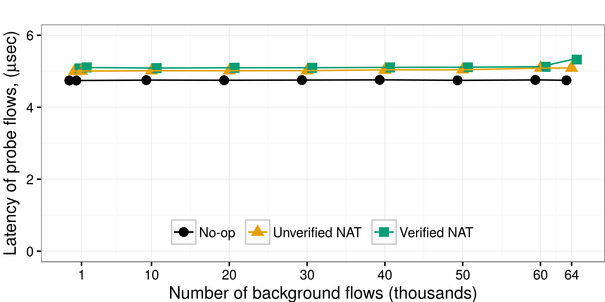
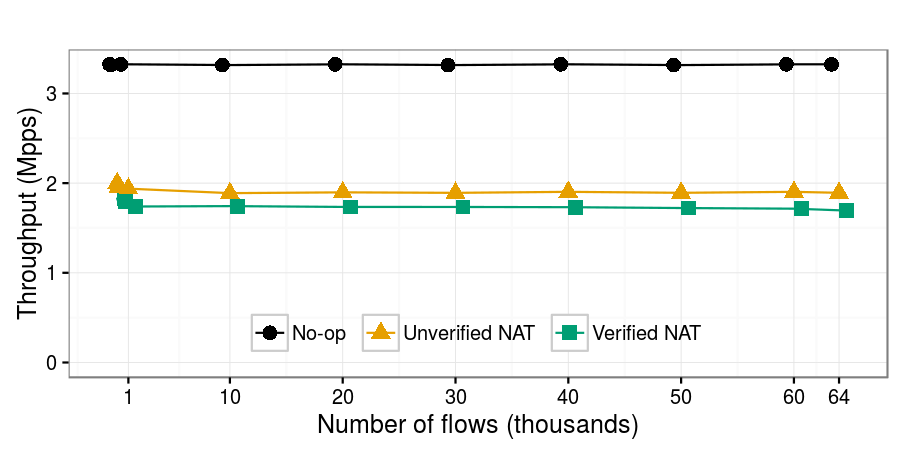

# {{ page.title }}

### Overview
{::options parse_block_html="true" /}

We present a <abbr title="Network Address Translator">[NAT][NAT]</abbr> written in C and proven to be semantically correct according to [<abbr title="Request For Comments">RFC</abbr> 3022][RFC3022], as well as crash-free and memory-safe.
There exists a lot of recent work on network verification, but it mostly assumes models of network functions and proves properties specific to network configuration, such as reachability and absence of loops.
Our proof applies directly to the C code of a network function, and it demonstrates the absence of implementation bugs.

We tackle the scalability challenge with a new combination of [symbolic execution](https://en.wikipedia.org/wiki/Symbolic_execution) and [theorem proving](https://en.wikipedia.org/wiki/Automated_proof_checking) using [separation logic](https://en.wikipedia.org/wiki/Separation_logic);
this combination matches well the typical structure of a network function.
We then demonstrate that formally proven correctness in this case does not come at the cost of performance.

#### Software Network Functions
{::options parse_block_html="true" /}

Software <abbr title="Network Function">NF</abbr>s have always been popular in low-rate environments, such as home gateways or wireless access points.
More recently, they have also appeared in experimental [IP routers](http://routebricks.org/) and [industrial middleboxes][brocade] that support multi-Gbps line rates.
Moreover, we are witnessing a push for virtual network functions that can be deployed on general-purpose platforms on demand, much like virtual machines are being deployed in clouds.
 
<a class="btn btn-primary hnfVSsnfBtn" data-toggle="collapse" href="#hnfVSsnf" aria-expanded="false" aria-controls="hnfVSsnf">
Hardware NFs vs. Software NFs
</a>

<h2> Hardware NF </h2>

<h2> Software NF </h2>

* Higher unit cost
* Bulky
* Needs care

<h1> VS </h1>

* Low unit cost
* Compact
* Recyclable
* Needs no care
 

Inspired by [this post](https://www.linkedin.com/pulse/technology-analogy-physical-virtual-network-functions-milind-kulkarni).

#### Reliability Perspective

Such popular NF as NAT however has proven hard to get right over time: the NAT on various Cisco devices can be [crashed](https://cve.mitre.org/cgi-bin/cvename.cgi?name=CVE-2015-6271) or [hung](http://cve.mitre.org/cgi-bin/cvename.cgi?name=CVE-2013-1138) using carefully crafted inputs;
similar problems exist in [Juniper’s NAT](https://cve.mitre.org/cgi-bin/cvename.cgi?name=CVE-2014-3817), the NAT in [Windows Server](https://technet.microsoft.com/en-us/library/security/ms13-064.aspx), and NATs based on [NetFilter](https://cve.mitre.org/cgi-bin/cvename.cgi?name=CVE-2014-9715).

The bugs periodically reach consumers affecting hundreds of thousands of households and often remain unknown for the users.
A recent example is this [firewall implementation](https://www.inforisktoday.com/researcher-att-routers-be-easily-compromised-a-10255) that undermined the isolation of many private networks.
Vigor certification would have flagged the missing physical interface check that lead to the possibility of the partial MAC brute-force attack.

On the other side, formal verification techniques have grown strong enough to certify complete and practical systems.
Such systems as a [compiler](http://compcert.inria.fr/), an operating
system [kernel](https://sel4.systems/), a distributed key value
[store](https://github.com/Microsoft/Ironclad/tree/master/ironfleet) or a file
[system](http://adam.chlipala.net/papers/FscqSOSP15/).

#### Method

The rationale behind our approach is that different verification techniques are best suited for different types of code.
The beauty of [symbolic execution](https://klee.github.io/) lies in its ease of use: it enables automatic code analysis, hence can be used by developers without verification expertise.
The challenge with symbolic execution is its notorious lack of scalability: applying it to real C code typically leads to path explosion [1,2].
The part of real NF code that typically leads to unmanageable path explosion is the one that manipulates state.
Hence, we split NF code into two parts:

* A library of data structures that keep all the “difficult” state, which we then formally prove to be correct—this takes time and formal methods expertise, but can be amortized if the library is re-used across multiple NFs.
* Stateless code that uses the library, which we automatically and quickly verify using symbolic execution.

The challenge lies in combining the results of these two verification techniques, and for that we developed a technique we call “lazy proofs”.
A lazy proof consists of sub-proofs structured in a way that top-level proofs proceed assuming lower level properties, and the latter are proven lazily a posteriori.
For example, symbolic execution requires the use of models that must be correct; we first do the symbolic execution and only afterward validate automatically the correctness of the models.
This approach enables us to avoid having to prove that our models are universally valid—which is hard—but instead only prove that they are valid for the specific NF and the specific properties we verified earlier with symbolic execution.
This is much easier.

[NAT]: https://en.wikipedia.org/wiki/Network_address_translation
[RFC3022]: https://tools.ietf.org/html/rfc3022
[brocade]: http://www.brocade.com/en/products-services/software-networking/network-functions-virtualization/vyatta-network-os.html
[mac-learning]: https://en.wikipedia.org/wiki/Forwarding_information_base
[DMZ]: https://en.wikipedia.org/wiki/DMZ_(computing)

### Results
{::options parse_block_html="true" /}

We compared key performance characteristics of four NFs (see our [paper](vignat-paper.pdf) for details):
*  Verified NAT - our verified VigNAT
*  No-op forwarding is implemented on top of DPDK;
   it receives traffic on one port and forwards it out another port without any other processing.
   It serves as a baseline that shows the best throughput and latency that a DPDK NF can achieve in our experimental environment.
*  Unverified NAT is also implemented on top of DPDK;
   it implements the same RFC as VigNAT and supports the same number of flows (65,535), but uses the hash table that comes with the DPDK distribution.
*  Linux NAT is [NetFilter](http://www.netfilter.org/), set up with straightforward masquerade rules and tuned for performance.
We expect it to be significantly slower than the other two, because it does not benefit from DPDK’s optimized packet reception and transmission.

#### Latency

The _Verified NAT_ (5.13μsec) has 2% higher latency than the _Unverified NAT_ (5.03μsec), and 8% higher than _No-op_ forwarding (4.75μsec).
So, on top of the latency due to packet reception and transmission, the Unverified and Verified NAT add, respectively, 0.28μsec and 0.38μsec of NAT-specific packet processing.
For all three NFs, latency remains stable as flow-table occupancy grows, which shows that the two NATs use good hash functions to spread the load uniformly across their tables.
The only case where latency increases (to 5.3μsec) is for the Verified NAT, when the flow table becomes almost completely full (the green line curves upward at the last data point).
The _Linux NAT_ has significantly higher latency (20μsec).

{: width="100%"}

#### Throughput

{: width="100%"}

This plot shows the maximum throughput achieved by each NF with less than 0.1% packet loss, as a function of the number of generated flows.
The _Verified NAT_ (1.8 Mpps) has 10% lower throughput than the _Unverified NAT_ (2 Mpps).
This difference in throughput comes from the difference in NAT-specific processing latency (0.38μsec vs. 0.28μsec) imposed by the two NATs: in our experimental setup, this latency difference cannot be masked, as each NF runs on a single core and processes one packet at a time.
The _Linux NAT_ achieves significantly lower throughput (0.6 Mpps).

### Contact
{::options parse_block_html="true" /}

<h5 class="card-title">Arseniy Zaostrovnykh</h5>

<a href="mailto:arseniy.zaostrovnykh@epfl.ch">
arseniy.zaostrovnykh@epfl.ch
</a>

<h5 class="card-title">Solal Pirelli</h5>

<a href="mailto:solal.pirelli@epfl.ch">solal.pirelli@epfl.ch
</a> 

<h5 class="card-title">Luis Pedrosa</h5>

<a href="mailto:luis.pedrosa@epfl.ch">luis.pedrosa@epfl.ch
</a> 

<h5 class="card-title">Katerina Argyraki</h5>

<a href="mailto:katerina.argyraki@epfl.ch">
katerina.argyraki@epfl.ch
</a> 

<h5 class="card-title">George Candea</h5>

<a href="mailto:george.candea@epfl.ch">george.candea@epfl.ch
</a> 

### References

- **\[1\]** Dobrescu, Mihai, and Katerina Argyraki. "Software dataplane verification." Proceedings of the 11th Symposium on Networked Systems Design and Implementation (NSDI), Seattle, WA. 2014.
- **\[2\]** Stoenescu, R., Popovici, M., Negreanu, L., and Raiciu, C. "SymNet: scalable symbolic execution for modern networks." In ACM SIGCOMM Conf. 2016.

